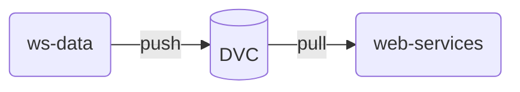
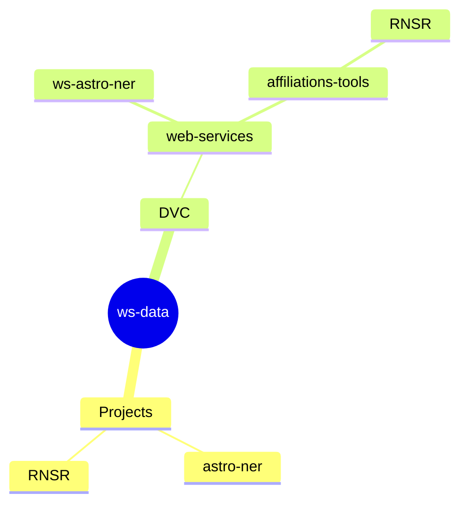

# ws-data

Dépôt de préparation des données pour les [services
web](https://github.com/Inist-CNRS/web-services).

Ces données peuvent être des tables de correspondance, des ressources
linguistiques, des modèles...

Nous les stockons via [DVC](https://dvc.org), pour pouvoir les réutiliser dans
d'autres projets (typiquement les services web).

Nous déposons ici les traitements préparatoires, afin de pouvoir les exposer et
les reproduire.

Chaque répertoire représente une expérience, un service web, auquel sont dédiés
les programmes et les données produites/traitées.

Chaque répertoire doit contenir un fichier de configuration déclarant les
dépendances utilisées.  
Pour python, c'est un fichier `requirements.txt` (éventuellement obtenu en
utilisant la commande `pip freeze`).  
Pour node, c'est un `package.json`.
